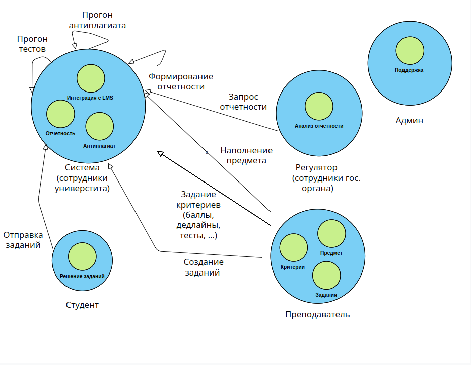
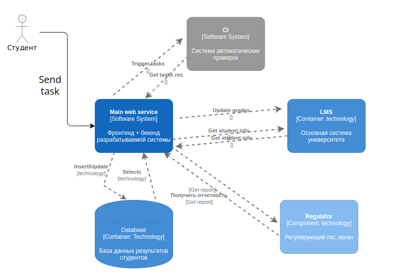

# Архитектурная ката
[Link](https://nealford.com/katas/kata?id=CheckYourWork)

A university has greatly expanded its CS course and wants to be able to automate the grading of simple programming assignments.

* Users: 300+ students per year, plus staff and admin.
* Requirements:
1. students must be able to upload their source code, which will be run and graded
2. grades and runs must be persistent and audit-able
3. required plagiarism detection system involving comparing with other submissions and also submitting to a web-based service (TurnItIn).
4. integration required with the University's learning management system (LMS)
5. professor sets due date and time, after which submissions are rejected
6. students can submit as many attempts as they want to improve their grade
7. professors determine grading criteria, which may include metrics and/or tests
* Additional Context:
1. University's LMS is mainframe based and quite difficult to make changes to
2. grades are audited each year by state-based regulatory body
3. University has very little budget for IT as it is building a spare stadium for SportsBall
4. University has a record for highest-performing CS graduates in the country

## Краткое описание системы
Разрабатывается система, автоматизирующая комплексную проверку ДЗ студентов.  
Предлагается, что будет создан веб-сервис с простым UI, в котором студент сможет зарегистрироваться.  
После регистрации студента, ему автоматически создается собственный репозиторий с необходимыми данными о предмете.  
За начальное наполнение содержания репозитория, заданий, написание тестов и 
разработку критерий оценивания ответственен преподаватель.  
Студент решает задачу и отсылает решение на конкретную ветку Git в нужном репозитории, после чего запускаются тесты и 
проверки антиплагиата в CI.  
Поведение CI может регулироваться преподавателем в зависимости от его критериев.  
По итогу, если CI джоба успешна, по API обновляется информация в системе.  
Система, получив данные, обновляет баллы студента в LMS и отражает их так же в отчете для регулятора (условно гугл-таблица).

## Бизнес возможности 
### Акторы 
- Студент
- Преподаватель
- Админ
- Проверяющая система (сотрудники университета)
- Регулятор (сотрудники регулирующего гос. органа)

### Сущности
- Предмет
- Задания 
- Критерии
- Решение
- Тесты
- Интеграция с LMS 
- Отчетность для гос. органа

### Действия
- Задать/изменить информацию по предмету
- Задать/изменить задания
- Задать/изменить критерии (баллы, дедлайны, тесты...)
- Загрузить решение 
- Проверить решение
- Проверить на плагиат
- Выгрузить отчетность 

## Взаимосвязи системы

## Компоненты системы

## Точки роста системы
* Очевидно, что так как есть дедлайны, то студенты будут вынуждены следовать им, а соответственно, 
значимая масса будет отправлять задания в последние дни/часы, из-за этого трафик в эти моменты резко возрастет => 
можно подумать об автоматизированной аллокации ресурсов (числа воркеров или их мощностей) в некоторый небольшой 
диапазон времени до дедлайна. Логично, что затем необходимо делать деаллокацию этих ресурсов.
* Студенты будут списывать => нужна система антиплагиата. Самый минимум, что можно сделать, считать хеш суммы измененных
файлов, если они совпадают, то два студента буквально имеют одинаковые работы, без каких либо изменений, что свидетельствует
о явном списывании. Понятно, что такой способ очень легко обходится и так можно отловить только работы списанные целиком, 
без изменений, для более тщательной проверки можно внедрить **AI** анализитатор, который будет выносить вердикт, а преподаватель или
ответственные лица будут отслеживать и валидировать его результаты.

## Технологический стек
Для бекенд части я бы выбрал **Python**, т. к. система не должна быть сложной и высоконагруженной + у университета нет денег,
а **Python** разработчики, как правило, несколько дешевле, чем некоторые другие, кроме того,
университет является одним из лучших в области **CS**, так что там точно преподавался курс по **Python** и можно привлечь студентов.
**Python** так же отлично подойдет для разработки **CI** инфры и **AI** анализатора антиплагиата.
**UI** с использованием отдельного frontend фреймворка нет смысла делать по той же причины ограниченности средств и
отсутствия какого-либо сложного интерфейса. Предлагается использовать простые **HTML**, поставляемые **Jinja** шаблонизатором.

## P. S. 
Такая автоматизированная система проверки студенческих работ **[manytask](https://github.com/manytask)** существует в ШАДе.  
Она буквально реализует все, что тут описано, кроме, возможно, автоматизированного поиска плагиата в работах студента.
